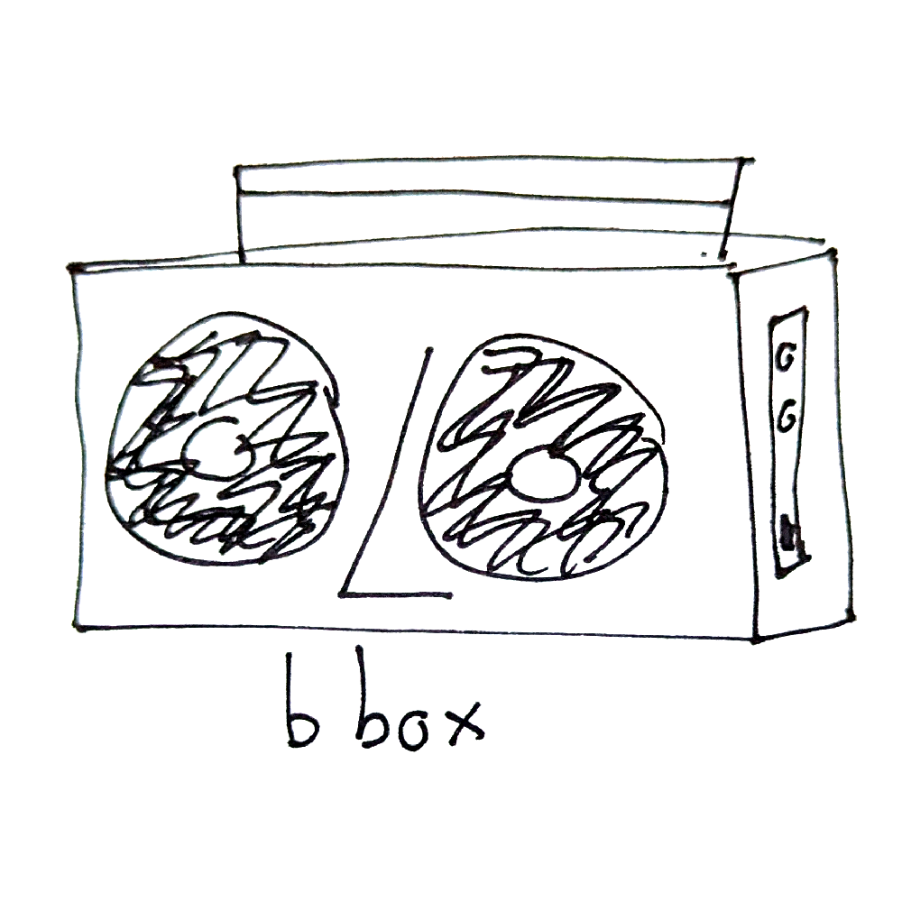

# bbox 

Bbox is a tiny bounding box interface to generate bounding
boxes.

My handwriting sucks and it seems that even the best AI
models can't read it 100% of the time correctly.
I am making more data for a finetune of something like the
Florence-2 models. 

I am using a model to automatically generate some captions using an
OCR Model named `Xenova/trocr-small-handwritten`.

The webapp is a single index.html file and you can read it
in an afternoon.