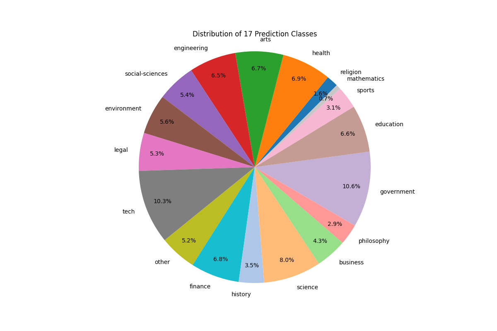

# Classiffing all of the pdfs on the internet* [WIP]

## TLDR: 

<summary> I classified the entirety of SafeDocs using a mixture of LLMs,
XGBoost and just for fun a LinearRegressor. In the process I too created some
really pretty graphs. If you would prefer a video version of this, you can
check it out on my new youtube channel right [here]()! </summary>

## Introduction

How would you classfy all the pdfs in the internet? Well, that is what
I tried doing this time.

Lets begin with the mother of all datasets: Common Crawl or CC which is a web
archive of all of the internet, it currently is petabytes in size and has been
running since 2007. Maybe, you know about the [Internet Archive](archive.org)
which is almost the same with the main difference being that Common Crawl
focuses more on archiving the internet for scientists and researchers. You
still have things like snapshots over time for websites, but, the web crawler
doesn't save the images, css or pdfs common to the Internet Archive.
Specifically, when Common Crawl gets to a pdf, it just stores the first
megabyte of information and truncates the rest. 

This is where
[SafeDocs](https://digitalcorpora.org/corpora/file-corpora/cc-main-2021-31-pdf-untruncated/)
or CC-MAIN-2021-31-PDF-UNTRUNCATED enters the picture. This corpus was
originally created by the [DARPA SafeDocs
program](https://www.darpa.mil/program/safe-documents) and what it did was
refetch all the different pdfs to have untruncated versions of them. This
dataset is incredibly big, it has roughly 8.4~ million pdfs that uncompressed
total 8TB. This corpus is the biggest pure pdf dataset on the internet[1]. 

So I tried classifying it because it doesn't sound that hard.

## Dataset generation

Lets define what classifying all of this pdfs using different labels actually
means. For example: I wanted to tag a Linear Algebra pdf as Math or an Anatomy
textbook as Medicine. 

<svg xmlns="http://www.w3.org/2000/svg" width="600" height="600" viewBox="0 0 600 600">
  <style>
    .title { font: bold 24px Arial, sans-serif; }
    .step { font: 18px Arial, sans-serif; }
    .emoji { font: 30px Arial, sans-serif; }
    .arrow { font: 24px Arial, sans-serif; fill: #4a90e2; }
  </style>
  
  <text x="300" y="40" text-anchor="middle" class="title">🍷 FineWeb-Edu Training Process 📚</text>
  
  <g transform="translate(300,100)">
    <text x="0" y="0" text-anchor="middle" class="step">
      <tspan x="0" dy="0" class="emoji">🔍</tspan>
      <tspan x="0" dy="30">Sample 500k documents from FineWeb</tspan>
    </text>
  </g>
  
  <text x="300" y="160" text-anchor="middle" class="arrow">⬇️</text>
  
  <g transform="translate(300,200)">
    <text x="0" y="0" text-anchor="middle" class="step">
      <tspan x="0" dy="0" class="emoji">🦙</tspan>
      <tspan x="0" dy="30">Annotate with Llama-3-70B-Instruct</tspan>
    </text>
  </g>
  
  <text x="300" y="260" text-anchor="middle" class="arrow">⬇️</text>
  
  <g transform="translate(300,300)">
    <text x="0" y="0" text-anchor="middle" class="step">
      <tspan x="0" dy="0" class="emoji">🧠</tspan>
      <tspan x="0" dy="30">Train classifier on annotations</tspan>
    </text>
  </g>
  
  <text x="300" y="360" text-anchor="middle" class="arrow">⬇️</text>
  
  <g transform="translate(300,400)">
    <text x="0" y="0" text-anchor="middle" class="step">
      <tspan x="0" dy="0" class="emoji">🔬</tspan>
      <tspan x="0" dy="30">Apply classifier to full FineWeb dataset</tspan>
    </text>
  </g>
  
  <text x="300" y="460" text-anchor="middle" class="arrow">⬇️</text>
  
  <g transform="translate(300,500)">
    <text x="0" y="0" text-anchor="middle" class="step">
      <tspan x="0" dy="0" class="emoji">🚫</tspan>
      <tspan x="0" dy="30">Filter out low-scoring samples</tspan>
    </text>
  </g>
  
  <text x="300" y="560" text-anchor="middle" class="arrow">⬇️</text>
  
  <g transform="translate(300,600)">
    <text x="0" y="0" text-anchor="middle" class="step">
      <tspan x="0" dy="0" class="emoji">🎉</tspan>
      <tspan x="0" dy="30">Result: 1.3T educational tokens</tspan>
    </text>
  </g>
</svg>

The reason for all of this is because I wanted to use LLMs in my personal
projects and I got this idea after reading the [Fineweb technical blog /
paper](https://huggingface.co/spaces/HuggingFaceFW/blogpost-fineweb-v1). The
FineWeb team endedup creating a subset for "educational" content  based on the
bigger FineWeb dataset. What they did was use a Teacher and student approach
where the LLM generates labels for unstructured text and then you train a
smaller student or "distilled" learner capable of classifying based on the
labels generated. 

So I decided to follow the same approach. The problem is that 8TB of data is
still a lot of information. I don't have 8TB laying around, but we can be a bit
more clever. The original dataset has the metadata available for download. Its
only 8GB in size!

In particular I cared about a specific column called `url`. I really care about
the urls because they essentially tell us a lot more from a website
than what meats the eye. For example:

```
https://assets.openstax.org/oscms-prodcms/media/documents/Introduction_to_Python_Programming_-_WEB.pdf
```

Specifically this part:

```
Introduction_to_Python_Programming_-_WEB.pdf
```

Tells us a lot of information.

I know that this url is going to be education or technology adjacent. For now,
lets just say its education because it has the "Introduction" part in its name.

Here is where the bit of prompt engineering that I used enters the picture.

### Few shot prompting

Few shot prompting is a fancy name for making an LLM learn with examples
without training it. Its a really cool trick that you can use and makes the
models output more coherent and consistent. I am going to give you an extremely
easy example of how one of this prompts look like:

```
Please follow the pattern and respond appropietly:
Q: 2+2 =
A: 4
Q: 5+10 =
A:
```

ChatGPT answers:

```
15
```

This might feel like magic if it is the first time you are using it, but LLMs
are incredible at following patterns and just showing how to do things can make
it improve their performance.

Using this method I generated 100k labels (to start) using this specific
[prompt](https://github.com/snat-s/m/blob/main/classify_metadata/prompt.txt)
and the Llama-3-70B model through the [together](together.ai) API.

The distribution of 100k labels looks originally like this:


So, as you can see, there is a lot of really small data points that are going
to be extremely annoying to classify. So guess what I'm going to do? I'm going
to ditch anything with less than 250 labels and label them as `other` just to
keep the most frequent examples for now.   

Because this labels are unbalanced, I decided to balance them and just take 5k
samples at the most of each possible label. This left me with a total of
59k labels:


With this newly minted dataset, I decided to start going after the training of the
new student classifier!

## Model Training

### Idea 1

<svg xmlns="http://www.w3.org/2000/svg" viewBox="0 0 400 300">
  <!-- Axes -->
  <line x1="50" y1="250" x2="350" y2="250" stroke="black" stroke-width="2"/>
  <line x1="50" y1="250" x2="50" y2="50" stroke="black" stroke-width="2"/>
  
  <!-- Data points -->
  <!-- Animals (blue) -->
  <circle cx="100" cy="150" r="4" fill="blue"/>
  <text x="110" y="155" font-size="12" fill="blue">dog</text>
  
  <circle cx="120" cy="180" r="4" fill="blue"/>
  <text x="130" y="185" font-size="12" fill="blue">cat</text>
  
  <circle cx="90" cy="200" r="4" fill="blue"/>
  <text x="100" y="205" font-size="12" fill="blue">elephant</text>
  
  <!-- Fruits (green) -->
  <circle cx="200" cy="100" r="4" fill="green"/>
  <text x="210" y="105" font-size="12" fill="green">apple</text>
  
  <circle cx="220" cy="80" r="4" fill="green"/>
  <text x="230" y="85" font-size="12" fill="green">banana</text>
  
  <circle cx="180" cy="120" r="4" fill="green"/>
  <text x="190" y="125" font-size="12" fill="green">orange</text>
  
  <!-- Vehicles (red) -->
  <circle cx="300" cy="180" r="4" fill="red"/>
  <text x="310" y="185" font-size="12" fill="red">car</text>
  
  <circle cx="320" cy="200" r="4" fill="red"/>
  <text x="330" y="205" font-size="12" fill="red">truck</text>
  
  <circle cx="280" cy="160" r="4" fill="red"/>
  <text x="290" y="165" font-size="12" fill="red">bike</text>
</svg>


I am going to introduce the idea of an embeddings model. For short, an
embeddings model is a model capable of passing things like text, images, video
or any other "unstructured" information to vectors in an ndimensional space
with semantic meaning. In other words, you can have some points that are near
each other like dog, cat, pet and this ones are going to be separated from
something like car, truck or vehicle.

With that in mind, this models are great for generating clusters of meaning.
This is going to be extremely useful for us, because we are going to just make
this model be capable of classifying the specific labels that we ended up
having through a process called finetuning.

Finetuning is were you grab an already trained model for a generic task and
just train it a little bit more for your particular problem. This case being
classification. If you want to learn more about finetuning you should check out
the first [fast.ai lecture](https://course.fast.ai/Lessons/lesson1.html) where
they finetune a model.

In the FineWeb paper, they used a total of 500k labels. Thats a lot more than
what I currently had, but at the time, I decided to ignore this (first
mistake). I went on with my life and decided to just start testing some models.
And oh boy, I realized that you can do a lot with just a gaming laptop.

In FineWeb Edu they used a specific embeddings model based on the
[snowflake-arctic-embed-m](https://huggingface.co/Snowflake/snowflake-arctic-embed-m).
But it is not the best embeddings model based on the [Massive Text Embeddings
Benchmark](https://huggingface.co/spaces/mteb/leaderboard). So I decided to try
some models that ranked really well in here. The problem with this benchmark is
that most of the models are too big, with roughly 7B parameters, I can not
afford to run that and expect it to classify 8 million pdfs quickly. So I
decided to instead go for the next best thing,
[Stella_en_400M](https://huggingface.co/dunzhang/stella_en_400M_v5). But the
problem was that I wanted to read how it worked and I don't really like when a
model is published and you go to a Github link that has a **TODO: add the rest of info**
in their README.

So, I decided to try out a range of models including the base model for Stella
called gte-1.5 and Arctic Embed. Along with others like all-mpnet-base,
distillbert, flant-t5-small and bert-base-uncased. # TODO: make this list full.

Finetuning a model is pretty simple with Huggingface because it abstracts a lot
of the code from you and thanks to just freezing the main model and training
the embeddings and the classifier head I could run the entire thing in my
laptop. After a series of runs, I found that for my problem the most performant
model was `Alibaba-large-gte-1.5`, it got up to 59.14% of accuracy on all
classes. That's not thaaat bad for a first attempt and such a low training
dataset.


I was a bit disappointed at this point because I had paid for a bunch of labels
and it seemed that I needed to be more careful on the training or generate a
bigger dataset.

But in my true lowest moment, I remembered that XGBoost existed. Yes, this
story is going to become an traditional ML story.

### Idea 2

This time, I am going to reframe the problem. Do you remember that the model
that I used in the first place was really good at generating this embeddings?
Well, what if this embeddings could be used to train another model? This time
the pipeline to train the model would look like the following:

url (in text) -> embeddings model (gte-large 1.5) + LLM Generated labeles -> XGBoost -> predicted labels. 

Another big extra from this would be that I can run a lot more experiments
because training an XGBoost model is way faster than training an embeddings
model. So I decided to generate all of the embeddings for the PDF links.
Generating all of the embeddings is a total of
[40GBs](https://www.kaggle.com/datasets/santiagopedroza/url-embeddings-cc-provenance)
uncompressed.

For those of you in the know, you could see this coming, XGBoost is THE
undisputed king of tabular data, it currently is the state of the art. If you
don't know the internals for XGBoost, I'm not explaining it in detail but
don't worry about it, the [StatsQuest Youtube
Channel](https://youtu.be/OtD8wVaFm6E?si=jDFbWR25-FakqryZ) has an amazing
series of videos where they explain them in like two hours.

For now, think about XGBoost as the `if else` version of AI. They are
THE simple transparent box that classifies extremely well.

Finally, the last change that I decided to do was to train simpler models.
Instead of training a big classifier, it could potentially be better to just
train a binary classifier per class. This idea I learned from an old [Kaggle
competition](https://www.kaggle.com/code/cdeotte/xgboost-baseline-0-680).
Thanks you [Chris](https://www.kaggle.com/cdeotte)! The main idea behind this
is to have tiny models that are really good capable of super fast inference for
specific problems, instead of trying to solve all of it with just one big
model.

With this in mind, the combined models have this as result!

```
Average Performance:
accuracy     0.839750
precision    0.859758
recall       0.819733
f1           0.838937
```

This approach is already winning against the original naïve deep learning approach
that I had by **24.83%**. 

### Idea 3

But guess what? You don't actually need deep learning to generate embeddings.
You can just split the text into smaller parts and count the occurrences of it.
There is a this thing called TFIDF that is almost that but it has a fancier
formula. So I decided to go full on out and just go back to the basics of NLP.
To my surprise, the resulting models where not complete garbage! 

They were actually capable of predicting something that wasn't as bad as I was
expecting:

```
Average Performance:
accuracy     0.675200
precision    0.683185
recall       0.646316
f1           0.662497
```

Better than my naïve approach!

I even trained a Linear Regressor ensemble that is better than the baseline
deep learning model.

```
Average Performance:
accuracy     0.706802
precision    0.723558
recall       0.663038
f1           0.690286
```

This is the moment where I felt that I messed up and I should have gone back to
the basics. If the point of this was actual production, I would be happy with
this models! 

But lets be real, I am just having fun in here, I don't really care about what
is the best, I want to try new things. 

### Idea 4

Back to the world of Deep Learning, at the end of the day, all of this are just
experiments and I wanted to see how far I could stretch my capacity of using
a single Deep Learning Classifier. My goal was extremely simple. I wanted to
get to at least 70% accuracy. 

The first thing that I made was generate a lot more labels, I feel like I did
Deep Learning a disservice by using so little data. So I generate another 400k
labels using Llama3.1-7B (this time a smaller model because I don't want to break
the bank on inference).

I did some experiments and to not bore you I saw that the more data the better
for my specific runs. So I decided to just do a dry run with two different
models, this time, influenced by the [The Llama 3 Herd of
Models](https://arxiv.org/abs/2407.21783) from Meta I used the roberta-base
model and the good old `gte-large` from before.

`gte-large` got me a lot closer to what I was expecting with results of up to 69.22%
accuracy on the training dataset[2].

### Results from experimenting

Here are the performances of all of our models!

|Model Name| Accuracy|
|----------|---------|
|gte-large naïve (59k labels)|59.14%|
|xgboost embeddings|83.97%|
|xgboost Tf-Idf|67.52%|
|LinearRegressor Tf-Idf|70.68%|
|gte-large naïve (400k labels)|69.22%|

I genuinely think that it was a skill issue from my side that I was uncapable
of making the Deep Learning model perform at the top of the performance chart.
Anyways, for now I am just going to grab the best model which was the XGBoost
embeddings model and really dial it in.

### Hyper Parameter Sweep

The last thing that I tried was a hyper parameter sweep on the XGBoost embeddings model
because it was the most performant overall. A hyperparameter sweep is basically a way to
move all the different nobs that the base model has so that it can perform to the best
of its abilities.

|Model Name| Accuracy|
|----------|---------|
|gte-large naïve (59k labels)|59.14%|
|XGBoost embeddings|83.97%|
|XGBoost Tf-Idf|67.52%|
|LinearRegressor Tf-Idf|70.68%|
|gte-large naïve (400k labels)|69.22%|
|XGBoost Embeddings HyperParameter Sweep|85.26%|

Now that we have some models, we can do the fun part and generate labels for
the rest of the entire dataset!

## Classifying all the corpus

The code is nothing fancy. It literally loads to memory some embeddings and
then predicts them. The distribution of predictions looks like the following:



It took roughly an hour to predict all of the pdf tags but this was because I
didn't make it run on GPU because I forgot to set it up that way. But even then,
I would have to say that it is not that bad!

Finally, I wanted to generate some incredibly aesthetically pleasing pictures.
And after doing some test runs on my local machine I decided to do some PCA and
UMAP visualizations of a looot of points. Like, ALL of the predictions +
embeddings. I am pretty sure this are not the biggest runs of PCA and UMAP
because those belong to the optimized versions from NVIDIA, but its pretty
crazy that you can run this on CPU and a loot of RAM without a problem.

For PCA I made a visualization of the entire dataset. All of the eight and a
half million dots in a single picture:


For the classifications, it looks like this:


Finally, for UMAP, I had to rent out a bigger machine and thanks to the kind
sponsorship of some credit from my internship. I rented out a Standard_E48s_v3
from Azure, this machine has 48 cores, 384 GB RAM and 768 GB disk. I ran
only 6.5 million points through UMAP because 6.5 million was the closest I
could get the machine before it went out of memory. I have a screenshot that
shows all of the might of UMAP draining the RAM.


So finally, for the final image, for me personally this is the show stiller:


And the classifications look like this:


## Conclusion

I feel like it was a fun experience to do overall but I could have done a
little bit better. Specifically with the Deep Learning stuff. At the time
I hadn't rented a lot GPUs and I was just using my laptop, so I got desperate
and decided to call it quits in the sake of time. This article is already
pretty long as it is.

At the same time, its impressive to have gone this far. I really think that it
is a big project that I got out this time. Considering that pdfs are a
mixture of data and images, I think we are going to start seeing them more and
more in training pipelines for LLMs. If you want to try another massive dataset,
you should try MINT-1T which has a PDFs and websites with images in there!

After all of this, I can confidently tell you that even now, I am pretty sure
you can do a lot better and you can easily surpass this. 

Thanks for reading up until here!

## Footnotes 

[1]  The only other rival is MINT-1T, but MINT-1T is a mixture of
HTML + PDFs.
