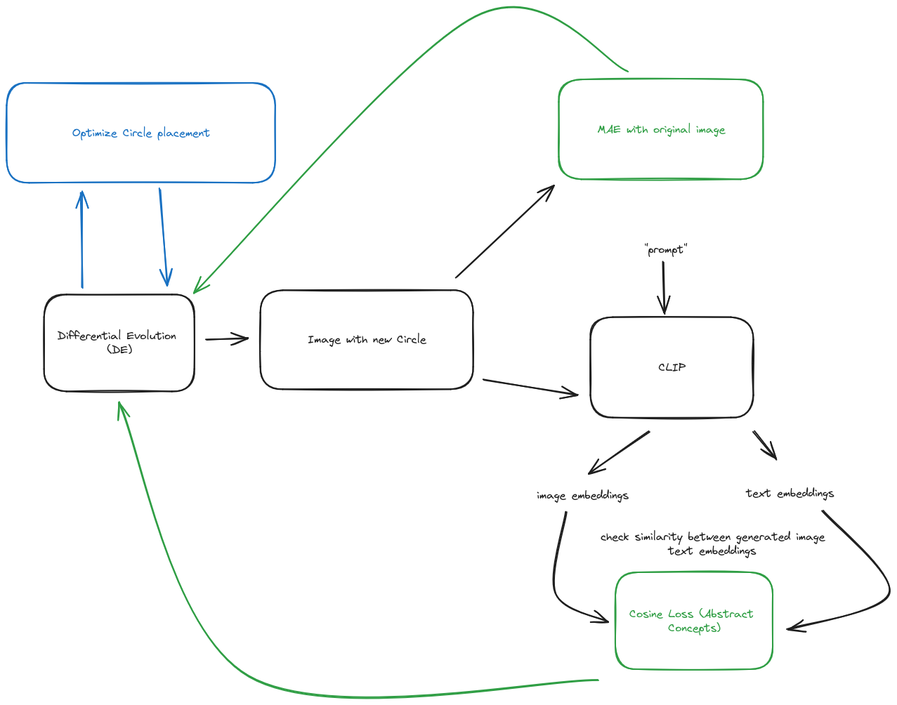

# DE + CLIP

This is a renderer for concepts using CLIP and Differential
Evolution. The pipeline is the following:

If you would like to read more about the subject, you can check
out the acompanying blog post in [here](https://snats.xyz/pages/articles/optimizing_images.html).
