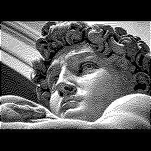
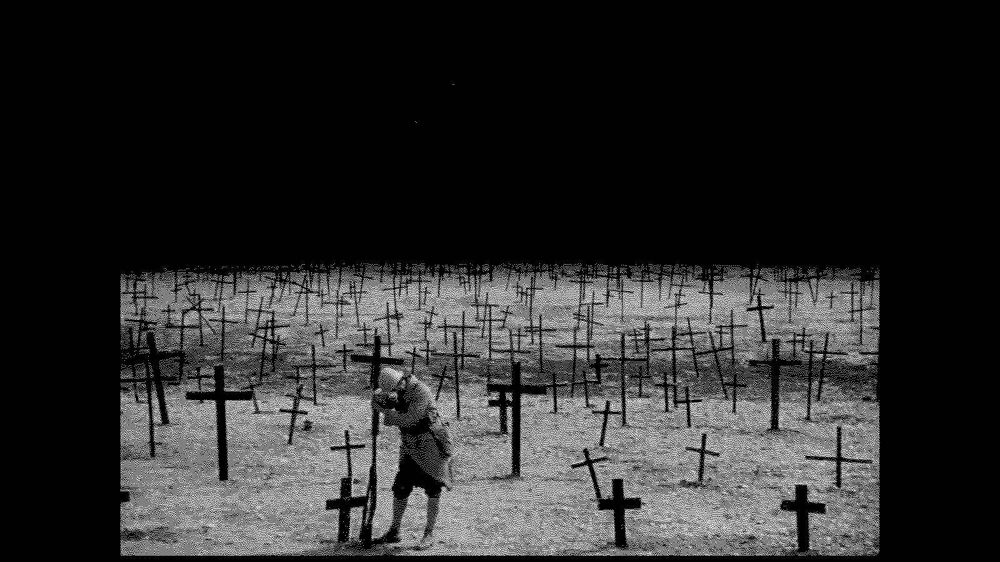

# atkinson

I was having fun with Atkinson Dithering. It's pretty cool that you can
get an entire old aesthetic out of it. 

I used python, but you should be capable of doing a lot faster with something like C
or Rust on this.


<table>
  <tr>
    <td></td>
    <td></td>
  </tr>
  <tr>
    <td></td>
    <td></td>
  </tr>
</table>

Ensure the images are committed in the repo and the paths are correct relative to the `README.md`.


If you are using `uv` just run the `atkinson.py` file and all deps should be
installed.

```bash
uv run atkinson.py
```

Maybe I'll start using this in my website instead of real images, it gives it a lot
more character.
