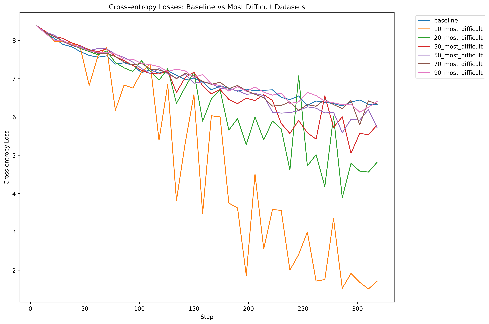

# I want to break some laws too
## TLDR:

I made an automated pipeline to clean data.  The idea started from a paper called Minipile. This led me to a rabbit hole. If you're careful about the data you use for training, you can can break the scaling laws. Who knew being a data snob could be so rewarding?
## Introduction

When I read about AI models using big datasets, I often think about something the ConvNeXt V2 paper said:

> The performance of a visual representation learning system is largely influenced by three main factors: the neural network architecture chosen, the method used for training the network, and the data used for training.

The data is the most important part of this formula. A clean and ready to use dataset makes you work faster. It lets you try out different architectures or training methods quicker.

This time around, everything started thanks to a paper that pruned the Pile dataset to 0.72% of its original size and got results that did not suck. Training a BERT and T5 language models on 2.6x and 745x  less data getting comparable results to the original versions with only a drop of 1.9% for BERT and 2.5% for T5 in the GLUE and SNI benchmarks.

This got me interested in trying to replicate their method. Soon, this developed into a big rabbit hole. How does the algorithm work? Is this approach translatable to other dataset styles? What is the potential limit for this?  
## Minipile


By today's standards, the Pile is small at [825 Gib](https://pile.eleuther.ai/) if you compare it against RedPajama-V2 ([270TB full](https://huggingface.co/datasets/togethercomputer/RedPajama-Data-V2/discussions/27)) or Dolma v1.7 ([4.5 TB](https://huggingface.co/datasets/togethercomputer/RedPajama-Data-V2/discussions/27)). But, it was a partition moment for the current paradigm of modern Open Source datasets. It was THE big dataset at the time that everyone was [using](https://en.wikipedia.org/wiki/The_Pile_(dataset)#Use).  The [Minipile](https://huggingface.co/datasets/JeanKaddour/minipile) in comparison is a toy dataset only at 6GB in size. With only a million samples from the original data source. But even then, this million samples pack enough of a punch to give you a good  dataset to train small language models. Anyways, enough with the introductions, what was the actual method to prune this much the Pile?

The cleaning pipeline used for generating the dataset is the following:

1. Generate Embeddings for the entirety of the dataset.
2. Cluster the embeddings using k-mean clustering.
3. **Manually** discard the clusters with low quality content.

This algorithm pipeline can be better because on the third step, they do **manual** work. We don't like doing work MANUALLY around here. Luckily for us, there is a new game in town that automates this style of task for us. Lets change the pipeline and use an LLM with few shot prompting so that we can keep the high quality clusters.

Another thing that I don't love is how they chose the amount of clusters:  

>  10 clusters per the Pile subset

The Minipile has 220 clusters. This is because the Pile had 22 different groups of data.

I don't love this idea, I know this is empirical but it seems to vibes based for me. There are other methods that are a bit more objective like the elbow or the silhouette method.

With the paper understood, the only thing that I had to do now is implement it! But on what?

### Deciding on a dataset

Choosing the proper dataset is a tiny little problem. I don't want to compute the embeddings of something like Olmo. Not because I don't want to, but because I don't have that amount of compute to do it.


So I left this problem untended until recently.  I learned about DataComp no so long ago. This dataset is a competition to train a CLIP and text model. In this competition you aim for accuracy by making the dataset better but the training code stays the same for everyone. I like it being a bit of a subversion of normal competitions. There are several different track sizes ranging from `small` (12.8 million images) all the way up to `xlarge` (12.8 billion). This dataset has it all: it is documented, it has an entire [paper](https://arxiv.org/pdf/2304.14108) with some baselines and guess what? They already have embeddings for all the images and captions.

Thanks to the generated embeddings, I can skip the first step of the pipeline. But, the dataset is kind of big, even for the small track (528 GBs). So I decided to download the embeddings and the metadata in my local computer. For the actual images I used a separate VM. I was an idiot and did not look into how to use DNS resolvers. This plus link rot with the dataset got me to download roughly 80% of the original thing.

But now, how would the full pipeline would look like?

Well, I'm glad you asked, here is a diagram:


### The elbow method

I wanted to be a bit less vibes-based on my approach to get the number of correct clusters. So I decided to go with the elbow method. It is still empirical but it's better than an estimation based on pure vibes.

The elbow method gives you the best balance between having the least amount of clusters and the most amount of compactness. It works by running k-means a bunch of times with different numbers of clusters and calculating the inertia for each run. This "inertia" is a fancy word for how packed your clusters are. The lower the inertia the better your clusters fit the data. Adding clusters improves results up to a point. After that, more clusters doesn't help much. This point is the "sweet spot."

If you have ever plotted a loss for a deep learning model, congrats! You already know how this is going to look like. The resulting elbow plot is basically the loss function from training an AI, where improvement plateaus after a certain point.


So with this in mind, I ran this method for the text embeddings and got a result that I interpreted at roughly 1300 centroids. Which for 12.4 million samples gives us an estimate of: ~9538 samples per cluster, so not thaat bad. Each concept would be semantically near each other but we would have some separation.

I tried this on two different ways: for the first experiments I clustered everything only based on the text and the second one was based on the concatenation of the images + text embeddings. The images + text clusters where a bit more sparse because there are more total possibilities. But more on the results a little bit below from here.

I want to show you some results from clustering only on text embeddings. It is interesting to see low value and high value clusters, so here is an example of a bad one:

```json
"Cluster_60": {
    "closest_samples": [
      "Image description",
      "image description",
      "Image description",
      "Image description",
      "Image Description"
    ],
    "furthest_samples": [
      "enter image description here",
      "enter image description here",
      "enter image description here",
      "enter image description here",
      "photo_1 (7) - Copy"
    ]
  }
```

And here is another one from a not so bad one:

```json
 "Cluster_25": {
    "closest_samples": [
      "Adventures in the Pacific Northwest",
      "Norfolk MA",
      "Smokey Mountains",
      "Northern California, close to the Eel River",
      "Kingwood Center Gardens"
    ],
    "furthest_samples": [
      "It's 10AM but I am waiting to eat because we are half an hour outside of Solvang, California and I'm craving Danish pancakes from Paula's Pancake House.",
      "Drinking in Durango: Our Weekend Trip to Ska Brewing&#039;s 22nd Anniversary Party | BottleMakesThree.com",
      "Bedford Chelsea by Wolverine in Dublin CA",
      "The Fillmore Miami Beach at The Jackie Gleason Theater is one of Eve 님이 좋아한 장소.",
      "O'Learys Seafood Brunch for Mothers Day Annapolis"
    ]
```

To this day I am impressed that anything good comes out in the first place from this models. But somehow, training on alt text just works™.

Anyways, now we use our best cluster number to run k-means on all the data. This puts each image and caption into a group, giving them labels. These labels will be useful when we classify the full dataset later. 
### Few shot prompting for cluster classification

The "new idea" here is how we label the clusters. Instead of doing it by hand, we use an AI model. We give it a few examples and some guidelines, then let it label all the clusters for us.

I did my part of prompt engineering with few shot prompting and did two different prompts! One that used the five examples nearest to the centroid of the cluster and another one that is more aligned with the original paper that grabbed the five closest ones plus the five furthest away from each cluster. The two prompts are [here](https://github.com/snat-s/m/blob/main/luvdatacomp/prompt.txt) and [here](https://github.com/snat-s/m/blob/main/luvdatacomp/only_nearest_points_prompt.txt).  

This time around I decided to go with Few Shot Prompting and a bit of Chain of Thought reasoning so that the model can give me a better answer. It is nothing fancy and I am pretty sure that you could build a more robust pipeline with something smaller but I was a bit lazy.

Both of them look quite similar but the basic idea is the same. Here is how it looks like for the one that only used the 5 nearest examples to the cluster:

```
# DataComp Cluster Quality Classifier for CLIP Model Training

Classify image-text clusters as either "High Value" or "Low Value" for training high-quality CLIP (Contrastive Language-Image Pre-training) models. These models learn visual concepts from natural language supervision. Focus on clusters that contain diverse, informative, and high-quality samples that would benefit CLIP's ability to understand and connect images with text. Avoid clusters with repetitive, low-quality, or potentially harmful content.

## Examples

### Example 1
Cluster data:
  "closest_samples": [
    "Detailed landscape photography of mountains",
    "Close-up of a rare flower species",
    "Historic architecture in European cities",
    "Portrait of a person from an indigenous culture",
    "Microscopic image of a unique cellular structure"
  ]
Reason: Diverse, informative content with high-quality imagery and educational value. Good for training CLIP on a variety of subjects and scales.
Classification: High Value

### Example 2
Cluster data:
  "closest_samples": [
    "IMG_001.jpg",
    "IMG_002.jpg",
    "IMG_003.jpg",
    "IMG_004.jpg",
    "IMG_005.jpg"
  ]
Reason: Generic filenames without descriptive content, likely low-quality or repetitive images. Provides no useful text-image pairs for CLIP training.
Classification: Low Value

A bunch of more examples...

## Cluster to Classify
Cluster data:
 "closest_samples": {cluster_data}
Reason: 
Classification:
```

This time around I used DeepSeek because it has prompt caching by default. It is beautiful to see how the requests end up being mostly cache hits. So classifying all this clusters was only a few pennies in the end.

An answer from the model looks like the following:

```
Reason: The cluster contains repetitive content focused on the brand Givenchy, with limited diversity in subjects and no clear educational or informative value. The samples are primarily brand-focused without providing detailed descriptions or diverse visual content that would enhance CLIP's understanding of broader concepts.
  
Classification: Low Value
```

```
Reason: The cluster contains a diverse range of literary and historical content, including study guides, music recordings, fantasy books, horror eBooks, and literary selections. This variety provides a rich set of text-image pairs that can help CLIP understand and connect different types of cultural and educational materials.

Classification: High Value
```

The only thing that we have to do now is to clean up our responses and we can do that with a couple of regexes for our answers. 
### Something, something, success!

Now that we have our dataset, we can train a couple of models! I trained five different models: 
1. *my_baseline*: A simple Baseline to see how the final model would be considering that I only had 80% of the data.
2. *minipile_style_trained_img_txt*: The minipile style of using the five furthest and closest examples plus using images and text embeddings for the clusters.
3. *minipile_style_trained_txt*: The minipile style of using the five furthest and closest examples using only text embeddings.
4. *txt_top5_all_quality_clusters*: All of the high quality clusters, using only the five nearest examples to the centroid in text embeddings.
5. *txt_top5_english_quality_clusters*: Only the English high quality clusters, using only the five nearest examples to the centroid in text embeddings.

Finally, I used a modified version of the `aggregate_scores.py` function from the DataComp code so that it could take multiple files at once.

| Model                             | ImageNet | ImageNet dist. shifts | VTAB[^1] | Retrieval | Average | Ideal Labels | Labels Seen | Percentage of original dataset[^3] |
| --------------------------------- | -------- | --------------------- | -------- | --------- | ------- | ------------ | ----------- | ---------------------------------- |
| baseline from DataComp paper      | 0.025    | 0.033                 | 0.145    | 0.114     | 0.132   | 12800000     | 12800000    | 100%                               |
| my_baseline                       | 0.026    | 0.034                 | 0.148    | 0.112     | 0.137   | 12800000     | 10386623    | 81.15%                             |
| minipile_style_only_txt           | 0.010    | 0.018                 | 0.134    | 0.067     | 0.111   | 933381       | 739116      | 5.77%                              |
| minipile_style_txt_img            | 0.021    | 0.025                 | 0.120    | 0.077     | 0.114   | 1633210      | 1290236[^2] | 10.08%                             |
| txt_top5_all_quality_clusters     | 0.022    | 0.031                 | 0.132    | 0.102     | 0.126   | 3660046      | 2864016     | 22.38%                             |
| txt_top5_english_quality_clusters | 0.015    | 0.026                 | 0.145    | 0.081     | 0.121   | 1712451      | 1316522     | 10.29%                             |
Weirdly enough, my trained baseline that lacked a couple of examples was a little better than the one directly from DataComp. But besides that, I found the results pretty interesting.[^4]


The best model that I trained was the one using only the top 5 examples nearest to the centroid. It had a drop of only .005 points on ImageNet. Besides this, the model trained only on English performed pretty well on **Retrieval** with only a drop of 0.003. Such a small drop is pretty interesting considering that we are only using at most 22.38% of the dataset! Even getting a 0.021 drop on the average is pretty impressive for the model only trained on 5.77% of the original dataset.


You can even see kind of a trend line in this second image if you squint your eyes hard enough. As always, it seems that 'the more data the better'™ is true in here. But not completely, look at that baseline, it is worse than my baseline. That should not happen. Right?

Normally here is the part where I would be writing a conclusion trying to explain what happened. But, I have just baited you into the second part of this article. The part that is more experimental. Below, is where the real rabbit hole begins where I realized that Big Data is not always what you need.

## Going from Power to Exponential

I was re-reading the Minipile paper when one of the paragraphs caught my attention. 

> Second, we cluster the embeddings, motivated by recent work demonstrating clusterability of data subset embeddings [25, 54].

 I decided to check the references and the first papers title sounded intimidating: "Probabilistic Active Meta-Learning" so I decided to go for the second reference. The title sounded bad ass: "Beyond neural scaling laws: beating power law scaling via data pruning".

In the second paper, they introduce the idea of breaking the usual scaling laws.They showed both an empirical and theoretical justifications for their approach to doing it. They even show that **you could go from power law scaling to exponential scaling**.

After skimming the other paper, I realized that the method that we've been doing is pretty similar. The main idea is to generate embeddings and grab a subset of examples from each centroid.
### All roads lead to Physics

The main idea of this paper comes from the [replica method](https://ithems.riken.jp/download/file/18/Intro_RM_rev.pdf), a tool from the statistical mechanics world. I know that it sounds pretty hard, but I promise it's actually a clever way to tackle complex systems.

Statistical mechanics models the behavior of systems with a lot of particles like gases or liquids. In this case, our dataset is our complex system where each data point is like a particle in the system.

In our case, the randomness comes from two main sources:

1. The underlying distribution of data.
2. The specific samples we choose for our dataset.

By applying the replica method you can predict the average performance of ML models across datasets! 

But, the behavior of our model is only part of what we are currently doing. We need to determine which data we should use for training to get better model performance. This is where we can break the power laws and do the exponential improvement that we are searching for.
### What data do we go for?

You have a decision style tree:


You might not like it, but this decision tree is basically the optimal data selection strategy depending on the size. Of course, it's not black and white, there's a gradient, and every dataset is different.

The good thing is that the authors of this paper proposed a method to select the hardest or the easiest examples without any human supervision. And guess what? It's pretty similar to what the Minipile was already doing, so we can reuse a lot of the code we already had. Neat, right?

But it gets better. It allows us to trace what's called the Pareto optimal frontier. This frontier is the sweet spot where we're getting the best performance for the least amount of data.

So, what does this new pipeline look like?

1. Generate embeddings for your dataset.
2. Do KMeans clustering for them.
3. If you have few examples, grab the points nearest to the centroid. If you have a lot of examples, you choose the examples furthest away from your centroid.

In here a trade off happens that most of the time is ignored. The more you refine a dataset, the more compute you use for preprocessing, but the actual model training training becomes shorter and shorter. This could become a law, you know what? Let me plot you what I mean.


Phrased nicely:

> The more you refine a dataset, the less you have to train the model.

They talk about this in the paper, but they say it in another way. They say that you amortize the cost of training through the refinement of a dataset, yielding to lower costs in trained models down the line. They named this refined datasets: _Foundational dataset_. What I am saying is an observation from that.


In the paper, the theory actually tracks with the practice, however the heuristic they came up with is still not perfect.

But the main idea is still true. We don't need 100% of the datasets because most of the time we develop methodologies to better train our models[^5]. Look for example at [FineWeb-Edu](https://huggingface.co/spaces/HuggingFaceFW/blogpost-fineweb-v1) where they trained an AI model that performs fantastic with a fraction of the entire dataset.

Anyway, remember all that Minipile magic and neural scaling law we talked about? Well, buckle up, because we're about to crank this data pruning up to 11.
### Building the last step

As a refresher, this is the pipeline:

1. Generate embeddings for your dataset.
2. Do KMeans clustering on them.
3. If you have few examples, grab the points nearest to the centroid. If you have a lot of examples, you choose the examples furthest away from your centroid.
   
We almost have the complete pipeline because DataComp implemented number one and I implemented number two. So I chose to build the third step for this. 

I wanted to see two main things: 

1. how much we could prune the dataset so that we see comparable results to the original baseline and 
2. I wanted to see this scaling at home!

I chose to prune 90% of the data all the way up to the baseline that I trained earlier. Going from hard examples to easy ones. My thought process for going with the hard examples was out of intuition. 12.4 million images are a lot of images. Training from easy to hard examples is left as an exercise to the reader[^6].

The only variable changed in here was the dataset size. Both, the hyper parameters and the compute allocated was the same. I used the same training code from DataComp as in the first part.



The loss charts for me are interesting because the training run with only 10% percent over fits way more. The rest of the models are closer to each other in their final cross entropy. Now, let's see how accurate the models are on something like ImageNet.


The accuracy of the model starts low and increases up to the 80% mark. But, if you train with more than that it decreases a little bit. The "supervised" methods worked better but lacked the amount of images. In here, what would be interesting would be to scale this method up to other categories like `large` or `xlarge`.


I ended up fitting a logarithmic plot and as you can see, there seems to be a trend in here. You go up fast but it tapers off if you use the entire dataset. How did I decided on a logarithm fit? This is what happens with logarithms so that's why I played with that.


In the end, I didn't get amazing results, some of the original DataComp baselines were better than what I got. But oh boy did I not learned a lot from here. If you want to see better results than this, checkout the [leaderboard]([https://www.datacomp.ai/dcclip/leaderboard.html](https://www.datacomp.ai/dcclip/leaderboard.html)).
## Conclusion

I liked going from zero to one on this one. Building a pipeline that you can use and it works for in either a supervised or unsupervised manner. For the Minipile, you can still make my pipeline better by using both text and images instead of only text. As for the second method, I would love to try it in bigger scales so that we could see if this "saturation" keeps on happening or it breaks at some point.

I liked that both of this methods translated to other styles of data. The statistical method only worked for images and the Minipile for text. So it is nice to see that both of them work with images + text. I was not expecting the Minipile method to work so well only using text.

We are doing ourselves a bit of harm by not pushing the idea of foundational datasets more into the open. We could in theory use less resources. At the end of the day you don't need the entirety of the internet for better foundational models. It is always a mixture of better and more diverse data.

If you want to keep on playing with this, you can! The code is completely open source and you can find it in my mono repo right [here]([https://github.com/snat-s/m/tree/main/luvdatacomp](https://github.com/snat-s/m/tree/main/luvdatacomp)). The dataset training lists that I created are [in huggingface](https://huggingface.co/datasets/snats/datacomp_lists). The different models from the different runs can are in this other [repo](https://huggingface.co/snats/clip-datacomp-models)[^7]. Also, and this is a secret between you and me, but you can access the version of DataComp small I downloaded right [here](https://huggingface.co/datasets/snats/small_datacomp_all) with images and everything so that you don't have to download the entire thing.

### Takeaways

I know that it is a pretty long blogpost, so that is why I am adding this part: 
- More data != always better.
- Data pruning can break neural scaling laws from power laws to exponential scaling.
- The more you refine a dataset, the less you have to train the model.
- As a community we should try to do "foundational datasets". What this means is that heavily refined, high-quality datasets can amortize the cost of AI training over time.

## Appendix:

### Making Datacomp run

I have to note, every single repo that I have used from researchers is normally not maintained. Besides that it is a mess of dependencies. To this extent, Datacomp was no different, you have to make a series of hullahoops to make everything run correctly. This is a quick tangent on how to make it run in a fresh vast.ai machine:

```bash
pip install cython
```

```bash
apt install build-essential libgl1-mesa-glx -y
```

Then, you have to modify the `environment.yml` file and change the version of `pyyaml`:

```
diff --git a/environment.yml b/environment.yml
index 7edef6d..c182a1e 100644
--- a/environment.yml
+++ b/environment.yml
@@ -139,7 +139,7 @@ dependencies:
       - python-dateutil==2.8.2
       - pytz==2022.6
       - pywavelets==1.4.1
-      - pyyaml==5.4.1
+      - pyyaml==6.0
       - qudida==0.0.4
       - regex==2022.10.31
       - requests==2.28.1
```

Finally, run:

```bash
bash create_env.sh
```

After all of that the only thing that is missing is to activate conda and then activate the environment:

```bash
source /opt/conda/etc/profile.d/conda.sh
conda activate datacomp
```

I was using `conda` because I wanted to replicate this as closely as possible, but I think a better idea for next time would be to just create an empty environment and install everything directly. Lessons learned from debugging weird dependencies. 
## Footnotes

[^1]: It was the first time hearing from [VTAB](https://google-research.github.io/task_adaptation/), but it is a benchmark compromised of a bunch of other benchmarks to see how well the model generalizes across the table.
[^2]: I didn't capture it whilst I was training the model, but its ~80% of the original dataset.
[^3]: The column was calculated by doing $row/12.8M$.
[^4]: I think that if you used an image and text prompt you could get easily better results on this. This specific idea is left to the reader as an exercise.
[^5]:  I know that its really tough to build an amazing dataset. As always, how are you supposed to know if there is redundancy in your dataset? Like this is the job of the builders of models not of the builders of datasets. 
[^6]: I'm out of compute and patience in here hehe.
[^7]: I was really dumb and did not save the weights for the top 5 txt models but you can replicate it if you want to because I saved the original list of uids. Also, I saved the entire list of results that the DataComp program outputs so that should be helpful too.