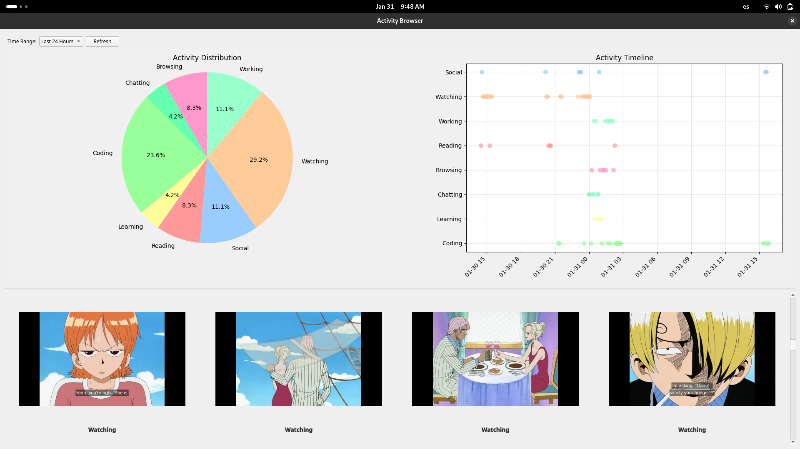

# snooper.py

i really wanted to see how i was using my computer day to day.
so i decided to create a tiny piece of what some would consider malware but
i really consider just a way of classifying my day to day tasks. 

`snooper.py` takes a screenshot of your computer every 5 minutes, sends it to an ai
model (in this case Qwen2-VL-72B-Instruct) and classifies it into a particular
task. it then saves it into a local sqlite database with the classification.

its for my personal use, so that is why i am using `gnome-screenshot`.

i also made a tiny ui that tells you exactly what you've been doing recently.

i don't know if at some point i will make it completely open source but for now
it's pretty much making what i want.

also, the category for working is literally when i have a zoom class so ignore
that one.

